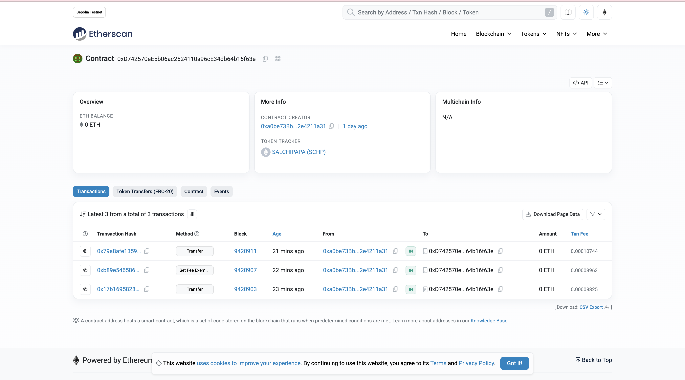
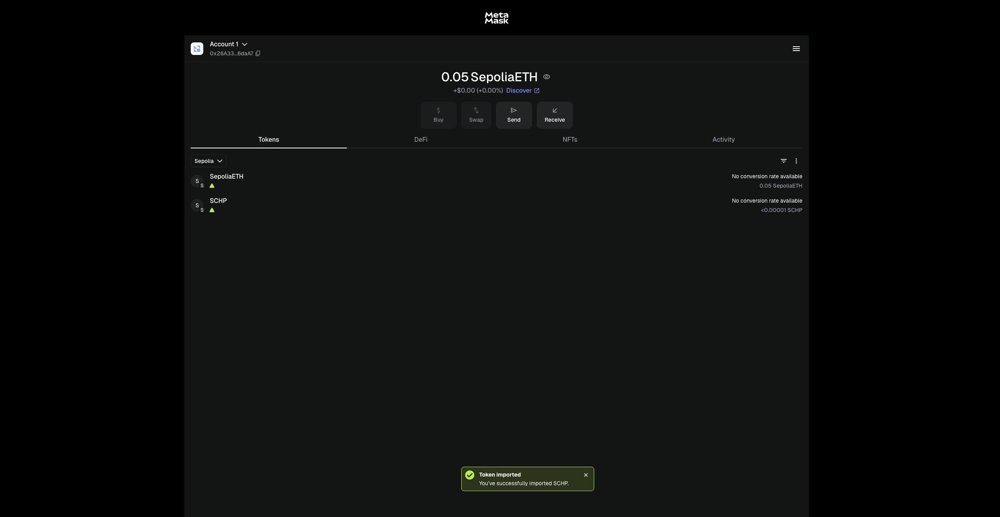

# Token SALCHIPAPA (SCHP) — Proyecto ERC-20 con Impuesto

## Descripción del Proyecto
Este proyecto implementa un **token ERC-20 con impuesto**, desarrollado con la librería **OpenZeppelin** y desplegado en la red de prueba **Sepolia**.  
El contrato aplica una tarifa configurable (*taxFee*) que se destina automáticamente a una dirección de **tesorería (treasury)** cada vez que se realiza una transferencia.

El objetivo de la actividad fue **desarrollar, desplegar y verificar** un contrato inteligente que gestione:
- Transferencias con impuesto.
- Pausas de contrato.
- Privilegios de propietario (*Ownable*).
- Exenciones de impuesto para cuentas específicas.

---

## Contrato Inteligente
**Nombre del contrato:** `TokenConImpuesto`  
**Archivo fuente:** `TokenConImpuesto.sol`  
**Versión de Solidity:** `^0.8.20`  
**Licencia:** MIT  

**Bibliotecas usadas:**
- `@openzeppelin/contracts/token/ERC20/ERC20.sol`  
- `@openzeppelin/contracts/access/Ownable.sol`  
- `@openzeppelin/contracts/security/Pausable.sol`

---

## Funcionalidades Principales
- Token ERC-20 estándar con **nombre y símbolo configurables**.  
- **Impuesto ajustable** entre 0% y 100%.  
- **Tesorería** designada para recibir los impuestos.  
- Funciones de **pausa y reanudación** del contrato (`pause` / `unpause`).  
- Control de **propiedad (Ownable)** para funciones administrativas.  
- **Exención de impuesto** para ciertas direcciones (`setFeeExemption`).  
- Emisión inicial de **1,000,000 SCHP** al propietario.

---

## Despliegue
- **Red:** Sepolia Testnet  
- **Dirección del contrato:**  
  `0xD742570eE5b06ac2524110a96cE34db64b16f63e`  
  *(Ver en Etherscan: [https://sepolia.etherscan.io/address/0xd742570ee5b06ac2524110a96ce34db64b16f63e](https://sepolia.etherscan.io/address/0xd742570ee5b06ac2524110a96ce34db64b16f63e))*
- **Creador del contrato (owner):**  
  `0xa0be73BbA15e010933b8c45330909542e4211a31`  
- **Tesorería (treasury):**  
  `0x64342f5cC34b1f45884DfDEb2F69D9373cEc720e`  
- **Cuenta receptora (para pruebas):**  
  `0x26A33A97221242b75DD850F620525391E856daA7`  
- **Token tracker:** `SALCHIPAPA (SCHP)`  
- **Decimales:** 18  

---

## Ejemplo de Prueba
Se realizó una transferencia de **100 SCHP** con un impuesto configurado del **2%**:

- **Remitente:** `0xa0be73BbA15e010933b8c45330909542e4211a31`  
- **Receptor:** `0x26A33A97221242b75DD850F620525391E856daA7`  
- **Tesorería:** `0x64342f5cC34b1f45884DfDEb2F69D9373cEc720e`  

**Resultado esperado:**
- 98 SCHP → Receptor  
- 2 SCHP → Tesorería  

La transacción se visualiza en **Etherscan** (pestaña *Transactions*) y en **MetaMask** bajo el token SALCHIPAPA (SCHP).

---

## Evidencias

### 1. Contrato verificado en Etherscan

### 2. Token SCHP visible en MetaMask

---

## Equipo
- **María José Pava** — Recepción y pruebas del token  
- **Miguel Ángel Sánchez** — Despliegue y envío de tokens  
- **José Daniel Ramírez** — Verificación del contrato y configuración de seguridad  

---

## Enlace al contrato
🔗 [https://sepolia.etherscan.io/address/0xd742570ee5b06ac2524110a96ce34db64b16f63e](https://sepolia.etherscan.io/address/0xd742570ee5b06ac2524110a96ce34db64b16f63e)
