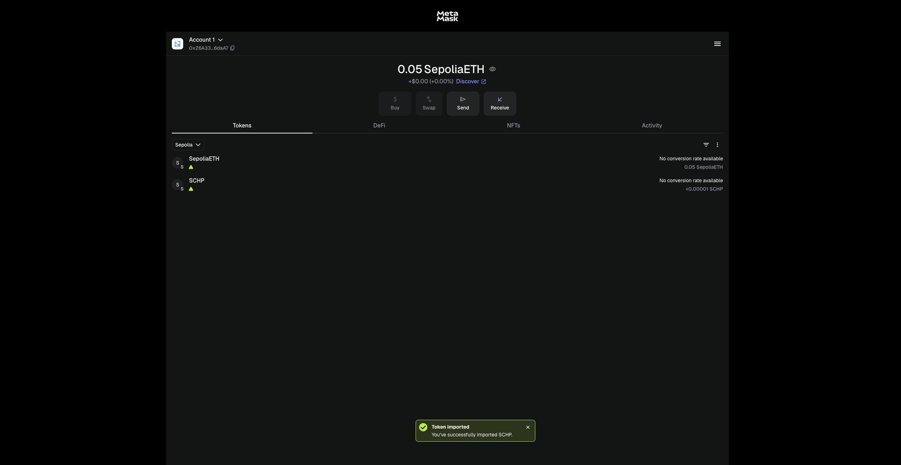

# Token MAGICO (Proyecto ERC-20 con Impuesto)

## Descripción del Proyecto
Este proyecto implementa un token ERC-20 con impuesto usando la librería OpenZeppelin, desplegado en la red de prueba Sepolia.
El token incluye una tarifa configurable (taxFee) que se destina automáticamente a una dirección de tesorería (treasury) cada vez que se realiza una transferencia.

El objetivo de la actividad fue desarrollar, desplegar y verificar un contrato inteligente que maneje transferencias con impuesto, pausas de contrato y privilegios de propietario.

## Contrato Inteligente
**Nombre del contrato:** TokenConImpuesto  
**Archivo fuente:** TokenConImpuesto.sol  
**Versión de Solidity:** ^0.8.20  
**Licencia:** MIT  
**Bibliotecas usadas:**
- @openzeppelin/contracts/token/ERC20/ERC20.sol
- @openzeppelin/contracts/access/Ownable.sol
- @openzeppelin/contracts/security/Pausable.sol

## Funcionalidades Principales
- Token ERC-20 estándar con nombre y símbolo configurables
- Impuesto configurable entre 0% y 100%
- Dirección de tesorería para recibir los impuestos
- Función de pausa y reanudación del contrato (pause / unpause)
- Control de propiedad (Ownable)
- Exención de impuesto para ciertas direcciones (setFeeExemption)
- Emisión inicial de 1,000,000 MAGICO al propietario

## Despliegue
- **Red:** Sepolia Testnet  
- **Dirección del contrato:**  
  0xD742570eE5b06ac2524110a96cE34db64b16f63e
  (Etherscan: https://sepolia.etherscan.io/address/0xd742570ee5b06ac2524110a96ce34db64b16f63e)
- **Creador del contrato (owner al inicio):**  
  0xa0be73BbA15e010933b8c45330909542e4211a31
- **Tesorería (treasury):**  
  0x64342f5cC34b1f45884DfDEb2F69D9373cEc720e
- **Cuenta receptora (para pruebas):**  
  0x26A33A97221242b75DD850F620525391E856daA7
- **Token symbol:** MAGICO  
- **Decimales:** 18  

## Ejemplo de Prueba
Se realizó una transacción de 100 MAGICO con un impuesto del 2%:

- Remitente (emisor): 0xa0be73BbA15e010933b8c45330909542e4211a31  
- Receptor: 0x26A33A97221242b75DD850F620525391E856daA7  
- Tesorería: 0x64342f5cC34b1f45884DfDEb2F69D9373cEc720e  
- Resultado esperado:
  - 98 MAGICO → Receptor  
  - 2 MAGICO → Tesorería

La transacción puede verse reflejada en la actividad de Etherscan (pestaña **Transactions**) y en la wallet de MetaMask bajo el token MAGICO.

## Evidencias
### 1. Contrato en Etherscan

### 2. Token MAGICO en MetaMask

## Equipo
- María José Pava
- Miguel Ángel Sánchez  
- José Daniel Ramírez 

## Enlace al contrato
https://sepolia.etherscan.io/address/0xd742570ee5b06ac2524110a96ce34db64b16f63e
